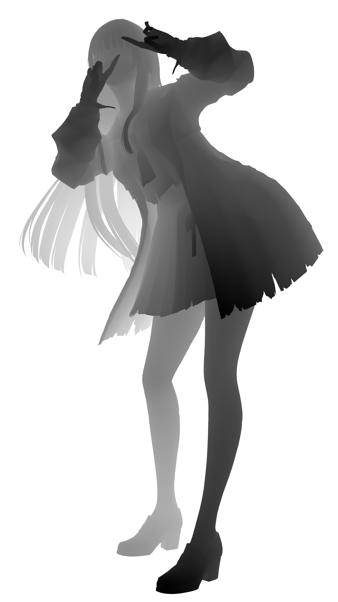
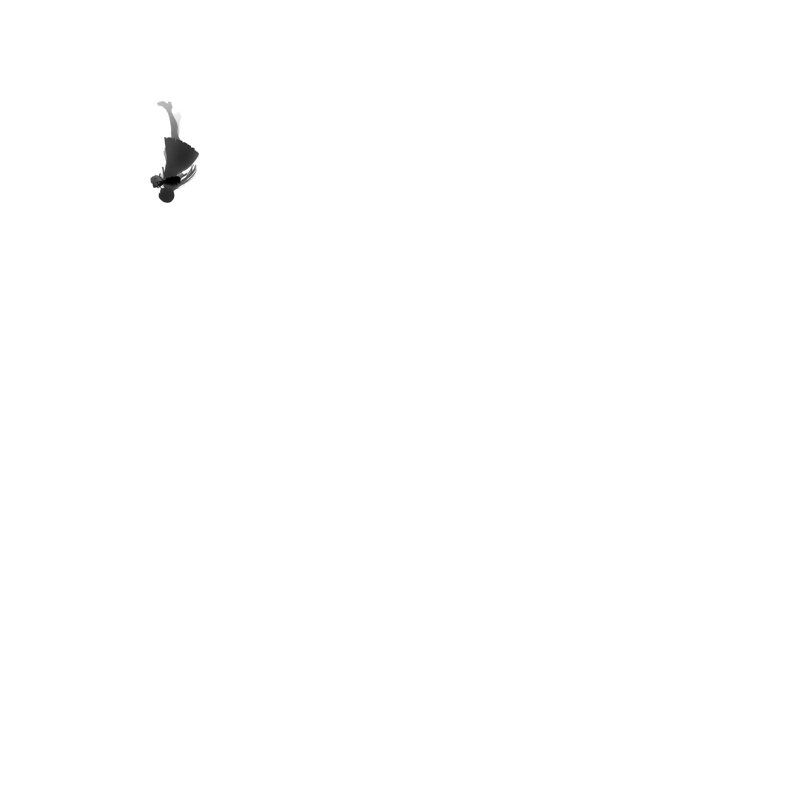
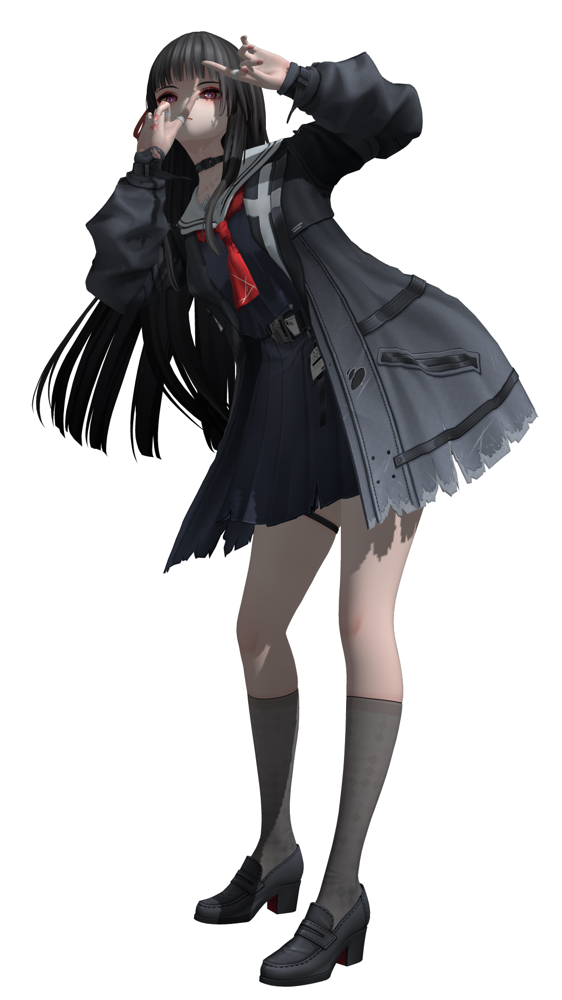

# RustGraph

基于 Rust 的 CPU 软光栅化渲染器。从 glTF 模型加载三角面片，通过完整的图形管线进行顶点变换、光栅化和片段着色，最终输出 PNG 图像。使用 nalgebra 进行数学运算，rayon 实现并行化，gltf crate 加载模型。

## 渲染管线

1. **模型加载** — 从 glTF/GLB 文件加载网格，提取三角面片的顶点位置、法线、UV 坐标、颜色和材质贴图。

2. **三角面片预处理** — 对每个三角形应用 MVP 变换到裁剪空间，转换为屏幕坐标，通过 model-view 矩阵的逆转置变换法线，计算包围盒，按材质透明度拆分为不透明和透明两组。

3. **阴影贴图渲染** — 使用方向光 + 正交投影渲染 3 级级联阴影贴图（4096/2048/1024），根据场景最大深度过滤活跃级联。阴影采用斜率缩放 bias 和 4 点双线性 PCF 滤波。

4. **分块光栅化** — 将屏幕划分为 128×128 的 tile，通过空间哈希将三角形映射到覆盖的 tile，rayon 并行处理每个 tile：
   - 边缘函数计算重心坐标
   - 透视校正深度测试
   - 透视校正插值颜色、法线、UV 和视线空间位置
   - 调用 PBR 片段着色器（Disney 漫反射 + 环境光 + 镜面反射 + 边缘光）
   - 透明面片按视线空间深度从远到近排序，不写深度缓冲，混合叠加

5. **SSAA 下采样** — 以 `ssaa_scale` 倍分辨率渲染（默认 4×），对每个最终像素取 scale² 个采样点的平均值。

6. **输出** — 保存 PNG 图像和调试中间结果（阴影贴图、视口深度图），通过 GLFW + softbuffer 显示窗口。

## 渲染结果

### 视口深度图

### 阴影贴图

### Disney 漫反射 + 间接光照补偿

